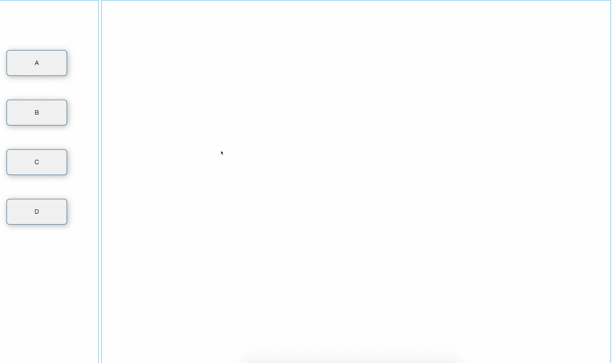

### overview



### usage

```
var context = $('#right');
const lasso = new Lasso({
    keycode: 16, // key code
    context: context, // container
    nodeClassName: 'node', // node class name
    checkedClassName: 'lasso_checked_nodes' // lasso class name 
});
lasso.create();
lasso.getCheckedNode((node) => {
    console.log(node, 'nodess');
});
```

1. press shift and drag mouse to choose item
2. press ctrl + v to emit copy listener